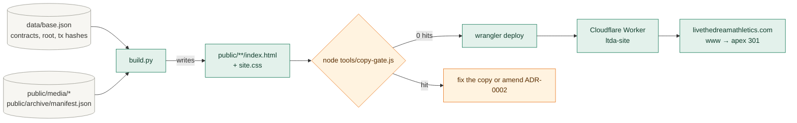
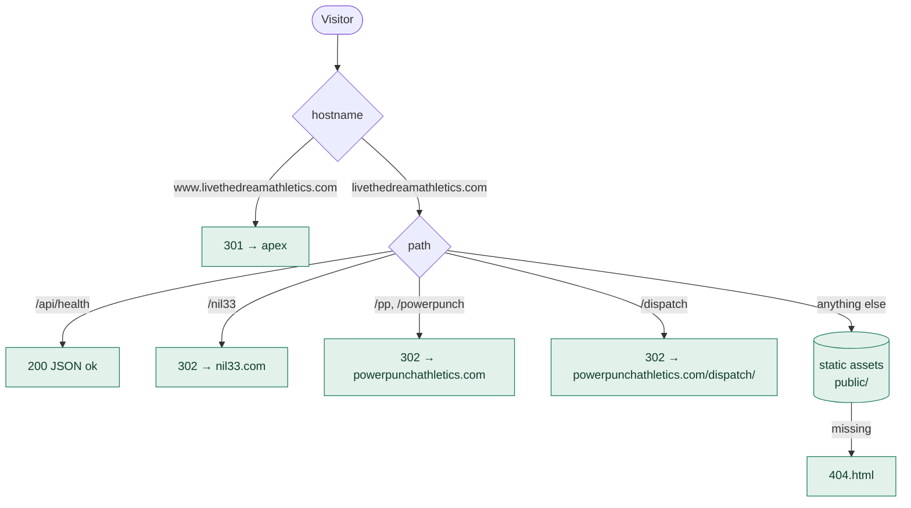
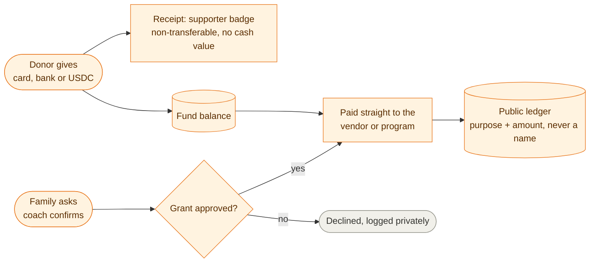
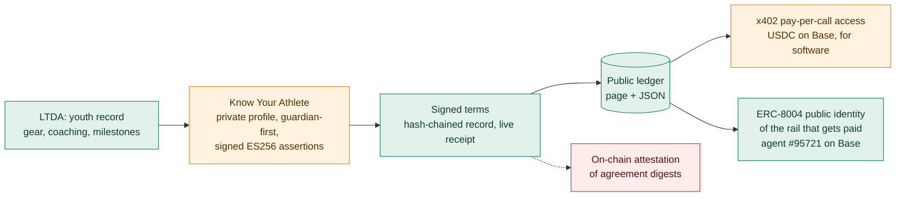
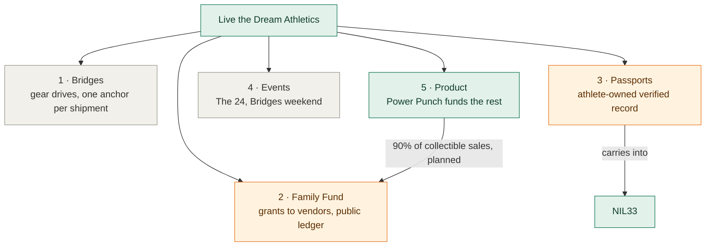
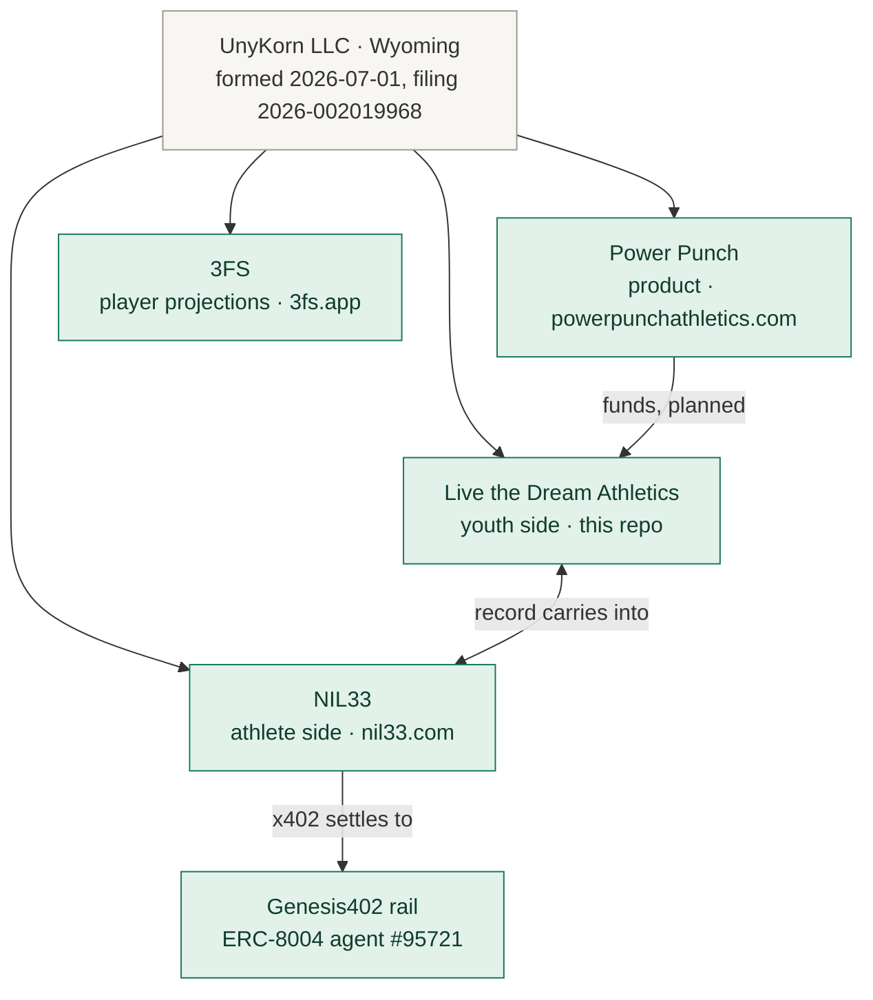

<p align="center">
  
</p>

<h1 align="center">Live the Dream Athletics</h1>

<p align="center"><b>We love the game. We're here to help.</b><br>
Gear, coaching and bridges between countries for young players since 2001. Now every record, receipt and badge goes on a public chain, so families and donors can check instead of trust.</p>

<p align="center">
  <a href="https://livethedreamathletics.com"></a>
  
  
  <a href="https://nil33.com"></a>
  
</p>

<p align="center">
  
  
  
  
  <br><sub>Every subsystem in this README carries one of these four labels. A label with no evidence next to it is a bug; open an issue.</sub>
</p>

---

## Table of contents

1. [What this is](#1-what-this-is)
2. [State at a glance](#2-state-at-a-glance)
3. [How the site is built and served](#3-how-the-site-is-built-and-served)
4. [The record: history archive on Base](#4-the-record-history-archive-on-base)
5. [The Family Fund](#5-the-family-fund)
6. [NIL33: the athlete side, in the open](#6-nil33-the-athlete-side-in-the-open)
7. [Five programs, one system](#7-five-programs-one-system)
8. [Where this sits in the UnyKorn family](#8-where-this-sits-in-the-unykorn-family)
9. [Repository layout](#9-repository-layout)
10. [Develop, check, deploy](#10-develop-check-deploy)
11. [Copy rules](#11-copy-rules)
12. [Verify it yourself](#12-verify-it-yourself)
13. [Open founder decisions](#13-open-founder-decisions)
14. [Sources and perimeter](#14-sources-and-perimeter)

---

## 1. What this is

The source of [livethedreamathletics.com](https://livethedreamathletics.com): a static site generated by one Python script, served by a small Cloudflare Worker, with its history archive fingerprinted and anchored on Base mainnet.

Live the Dream Athletics (LTDA) was started in 2001 by **Kevan Burns**, a former player in the Arizona Diamondbacks and St. Louis Cardinals organizations and a former player agent at Octagon. The site's own record (609 public posts, 2013 to 2020) covers equipment drives to Cuba, lessons in Beloit, clinics in Panama, and prospects placed in college and pro ball. [Source: `/history/`, `/international/` on the live site; Kevan Burns, 2026-10-07.]

LTDA is the **youth side** of the work. The athlete side, for college and pro NIL, is [NIL33](https://nil33.com) (section 6). Both are operated by UnyKorn LLC (Wyoming).

> **Standard:** records, receipts and badges are the only things ever put on chain. Families get help; nobody gets sold a token. Donations are gifts, not investments. Supporter badges are non-transferable and have no cash value.

## 2. State at a glance

| Subsystem | State | Evidence |
|---|---|---|
| Site, worker, domains (`livethedreamathletics.com`, `www` redirect, `/api/health`) |  | `src/worker.js`, `wrangler.jsonc`; live since 2026-09-19 (monorepo commit `fa44203`) |
| History archive: 33 files hashed, Merkle root anchored on Base |  | `public/archive/manifest.json` (built 2026-09-17), anchor tx `0x11797e…bcb272`, re-anchor `0x57a1d3…e57d75` (section 4) |
| PowerPunchUnit registry (ERC-721) and PowerPunchAffiliate badges on Base |  | `data/base.json`; `0xCf1660…f052`, `0xA67Ae4…79F7` (section 4) |
| Proof page with explorer links and a 3-step verification recipe |  | `/proof/` |
| NIL33 tie-in page and short link `/nil33` |  | `/nil33/`, `src/worker.js`; nil33.com live |
| The Family Fund (gifts in, grants to vendors, public ledger by purpose) |  | `/fund/` ledger shows no rows; legal wrapper not chosen (F-7, section 13) |
| Athlete passport (badge + parent-consent claim, verified entries) |  | `/systems/` lists it "In build"; no contract or page yet |
| Bridges gear drive #1 (logged shipments, one anchor per shipment) |  | plan timeline 2026 Q4 "announced"; nothing shipped under the new system yet |
| Events (The 24, Bridges weekend) |  | plan timeline 2027 |
| Spanish edition and audio narration |  | existed on the retired v1 site (`tools/make-es.js` kept); not yet rebuilt for v2 |
| NIL33 on-chain attestation of agreement digests |  | nil33.com flag F-21: spends from a key the founder has not named |

## 3. How the site is built and served

Every HTML page under `public/` is generated. Edit `build.py`, run it, commit the output, deploy. Media and the archive manifest are static inputs.



Request handling is deliberately tiny:



## 4. The record: history archive on Base

The archive is 33 photos and clips of the work. Each file is hashed, the hashes form a Merkle tree, and the root is written to Base mainnet. Anyone can download a file, hash it, and match it to the manifest and the chain without asking us.

```mermaid
flowchart LR
  classDef real fill:#e3f1eb,stroke:#187a5a,color:#0f3d2c
  classDef plain fill:#f7f6f2,stroke:#9a9a91,color:#33332f
  F[33 files<br/>public/media/*]:::plain --> S[sha256 per file]:::real
  S --> L["leaf = keccak256(sha256)"]:::real
  L --> T[sorted-pair keccak256 tree]:::real
  T --> ROOT["root 0x6194…b08f"]:::real
  ROOT --> TX1["anchor tx 0x11797e…bcb272<br/>2026-09-17"]:::real
  ROOT --> TX2["re-anchor tx 0x57a1d3…e57d75<br/>2026-09-18"]:::real
  T --> MAN[(public/archive/manifest.json)]:::real
  MAN --> PROOF[/proof/ page with explorer links]:::real
```

| Record | Where to check | Source |
|---|---|---|
| History root (33 files) | `0x619420a4b2ae498f92e46ee1d3590514a0dec578f45bda94e69692b86934b08f` | `public/archive/manifest.json`, `data/base.json.historyRoot` |
| History anchored | [tx 0x11797e…bcb272](https://basescan.org/tx/0x11797ee123b3ced26d14612d73f92096660fa6fa2ef2f4a25f8382ad32bcb272) | `data/base.json.txs.anchorHistory` (2026-09-17T15:34Z) |
| History re-anchored | [tx 0x57a1d3…e57d75](https://basescan.org/tx/0x57a1d3141eb369eb171f9304f234b515890d8c64c7602d194a36e8b64ae57d75) | `data/base.json.finish.anchorHistory2` (2026-09-18T01:59Z) |
| PowerPunchUnit (ERC-721 unit registry) | [0xCf1660…f052](https://basescan.org/address/0xCf1660AD2f6D0DD2E14924Fe96cDFC5199D6f052) | `data/base.json.unit` |
| PowerPunchAffiliate (non-transferable badges) | [0xA67Ae4…79F7](https://basescan.org/address/0xA67Ae45E1CB922A6060890EDCA0A8dB1174B79F7) | `data/base.json.affiliate` |
| Founder's run opened (500 units) | [tx 0x34bc4f…668487](https://basescan.org/tx/0x34bc4f3a3f9516be221d6d872a8dd2d7e991369a192236450ba7787a90668487) | `data/base.json.txs.openRun` |
| Unit #0001 minted | [tx 0xbcc577…c754e3](https://basescan.org/tx/0xbcc577805ccd213f43e07a438159888eba2e7c69ca6c0df5998cc67695c754e3) | `data/base.json.txs.mint0001` |

**Independently verified 2026-10-07** against a public Base RPC (`https://mainnet.base.org`, `eth_getTransactionReceipt`, `eth_getTransactionByHash`, `eth_getCode`, `eth_call`): all four transactions above have `status 0x1` (blocks 51434949, 51453705, 51434949, 51434950); the anchor transaction's input data contains the history root `0x6194…b08f`; both contract addresses hold bytecode (10190 and 6018 bytes); the unit contract's `name()` returns `Power Punch Unit`.

No personal data about any athlete is written on chain. The contracts' source lives in the `pp-chain` package of the `FTHTrading/powerpunch-chain` monorepo, not here.

## 5. The Family Fund

 Gifts in, grants out to the vendor or program, every payment on a public ledger by purpose, never a name, never a loan. The page is live; the ledger is empty because the fund has not opened. The legal wrapper is founder decision F-7 (section 13). Until it is chosen, nothing on the site or in this README calls the fund a nonprofit or its gifts tax-deductible.



Planned funding sources (from the 2026-2030 plan, not yet flowing): donations, the 90 percent split on Power Punch collectible sales, a slice of team-pack revenue.

## 6. NIL33: the athlete side, in the open

LTDA builds the record with families. When an athlete reaches college or pro NIL, that record carries into [NIL33](https://nil33.com), UnyKorn's transparent endorsement network: flat fees or none, signed terms, every deal on a public ledger, no commissions, and under 18 nothing without a parent's signature.



| On nil33.com | State | Link |
|---|---|---|
| Champions (paid, disclosed) and Ambassadors (unpaid, disclosed) |  | [/champions](https://nil33.com/champions), [/ambassadors](https://nil33.com/ambassadors) |
| Public ledger, page and JSON |  | [/ledger](https://nil33.com/ledger), `GET /api/ledger` |
| Electronic signing with chain hash and live receipt |  | [/sign](https://nil33.com/sign) |
| Know Your Athlete (government-ID step waits on a vendor) |  | [/kya](https://nil33.com/kya) |
| x402 paid endpoints (challenge live; settlement configured, not yet proven by a published settled call) |  | [/x402](https://nil33.com/x402), `/.well-known/x402.json` |
| ERC-8004 identity of the payee, self-registered, not a certification |  | [agent #95721](https://twin.unykorn.org/agents/genesis402) |
| The whole stack, layer by layer, with states |  | [/transparency](https://nil33.com/transparency) |
| What happened to college sports (sourced, dated) |  | [/chaos](https://nil33.com/chaos), [/rules](https://nil33.com/rules) |
| On-chain attestation of agreements |  | nil33.com flag F-21 |

This repository's `/nil33/` page summarises the above and links out; nil33.com is the source of record for everything in this table.

## 7. Five programs, one system

From `ltda-2026-2030` (the plan lives in the monorepo; summarised here):



| # | Program | State | What it is |
|---|---|---|---|
| 1 | Bridges |  | The gear drive, rebuilt as a standing program: every item logged donor to receiving coach, one manifest anchor per shipment, donors get a badge not a token |
| 2 | Family Fund |  | Section 5 |
| 3 | Passports |  | A non-transferable badge per athlete, claimed with a parent's yes under 18; verified entries only; hashes on chain, data with the athlete; scout view by permission |
| 4 | Events |  | The 24 (a 24-hour game, Beloit first, every inning sponsored); Bridges weekend (clinic plus gear delivery) |
| 5 | Product |  | Power Punch founder's run and registry on Base (section 4); retail at powerpunchathletics.com |

## 8. Where this sits in the UnyKorn family



Code homes: this repository (LTDA site), `FTHTrading/blockchainfraud` (the worker that serves nil33.com), `FTHTrading/powerpunch-chain` (Power Punch, 3FS, the `pp-chain` contracts, and LTDA's internal planning docs).

## 9. Repository layout

```
ltda/
├── README.md                 this file
├── build.py                  generates every public/**/index.html from inline templates + data/base.json
├── data/base.json            Base mainnet deployment record: contract addresses, history root, tx hashes (public data)
├── public/                   what Cloudflare serves (committed build output + static media)
│   ├── index.html            home
│   ├── history/ international/ today/ families/ nil33/ systems/ proof/ fund/
│   ├── archive/manifest.json 33 files, sha256 each, Merkle root (built 2026-09-17)
│   ├── media/                photos and logos (all already public on the live site)
│   ├── site.css  404.html
├── src/worker.js             Cloudflare Worker: www redirect, /api/health, short links, static assets
├── tools/copy-gate.js        forbidden-phrase gate over public/**/*.html (exit 1 on a hit)
├── tools/make-es.js          Spanish edition generator (from the v1 site; not yet re-pointed at v2)
├── wrangler.jsonc            production: worker ltda-site on livethedreamathletics.com + www
├── wrangler.preview.jsonc    preview: ltda-site-preview on workers.dev
└── .gitignore                keys, wallets, env files, build caches
```

Not in this repository, on purpose: private keys or wallets (never), the `pp-chain` contracts (monorepo), internal planning docs and the raw Facebook timeline export (monorepo, `ltda/docs/`; they name minors and third parties).

## 10. Develop, check, deploy

```bash
# 1. regenerate the pages (Python 3.10+; writes UTF-8)
python build.py

# 2. copy gate: must print "0 hits"
node tools/copy-gate.js

# 3. preview on workers.dev
npx wrangler@4 deploy -c wrangler.preview.jsonc

# 4. production (custom domains are in wrangler.jsonc)
npx wrangler@4 deploy

# 5. verify served, not repo
curl -s https://livethedreamathletics.com/api/health
curl -s -o /dev/null -w '%{http_code} %{redirect_url}\n' https://www.livethedreamathletics.com/
```

Deploys follow the UnyKorn FORGE discipline: a deploy receipt before, a served check after, and a rollback path (`wrangler rollback`). The build is deterministic: running `build.py` on a clean checkout reproduces the committed `public/` byte for byte.

## 11. Copy rules

`tools/copy-gate.js` fails the build on any of these in `public/**/*.html` unless the phrase sits inside a plain negation ("not a coin", "never sold"):

| Group | Forbidden |
|---|---|
| Financial framing | coin, token value, earn crypto, airdrop, floor price, to the moon, returns, appreciate, guaranteed |
| Hype | revolutionary, game-changing, best-selling, top rated, as seen on, #1, limited time, only N left, act now |
| Charitable status (until F-7 is decided) | tax-deductible, charity, nonprofit, 501(c) |
| Product claims | pure shooter, patent pending |
| Retired entities and misattributed identifiers | BitGo, UNYKORN 7777, TROPTIONS, the LEI and MIC that belong to another entity |

Governing documents: ADR-0001 (records, receipts and badges only) and ADR-0002 (approved and forbidden phrases) in the monorepo. The two live pages that carried "501(c)(3)" and "tax-deductible" before this repository was created were reworded on 2026-10-07 so the gate passes; see section 13.

## 12. Verify it yourself

1. **Pick a file.** Download any item listed in [`public/archive/manifest.json`](public/archive/manifest.json), for example `media/coach-cage.jpg`.
2. **Fingerprint it.** `sha256sum coach-cage.jpg` (or `certutil -hashfile coach-cage.jpg SHA256` on Windows). It must equal the `sha256` in the manifest. One changed pixel gives a different hash.
3. **Rebuild the root.** Leaves are `keccak256(sha256(file))`, paired in sorted order with keccak256 up to the root. The root must equal `0x6194…b08f`.
4. **Match the chain.** Open the [anchor transaction](https://basescan.org/tx/0x11797ee123b3ced26d14612d73f92096660fa6fa2ef2f4a25f8382ad32bcb272) on Base and compare the root in its input data.

If any step fails, email kevan@unykorn.org with the file name and the hashes you got. A mismatch is a bug report, and it gets published as one.

## 13. Open founder decisions

| Flag | Decision | Blocks |
|---|---|---|
| F-7 (LTDA plan) | Legal wrapper for the Family Fund: a fiscal sponsor, a program under an existing entity, or a new organisation | Opening the fund; any "nonprofit", "501(c)(3)" or "tax-deductible" wording anywhere |
| 2026-10-07 copy fix | `/fund/` said "finalizing a 501(c)(3) fiscal sponsor so gifts are tax-deductible" and `/systems/` said "built for a 501(c)(3)"; both failed `copy-gate.js` and were reworded to "the fund's legal wrapper". Restore the stronger wording only after F-7 is signed | Nothing live |
| F-68 (nil33.com) | Confirm or expand the founder bio wording (teams, Octagon, dates) | Press and partner outreach |
| F-21 (nil33.com) | Key and chain for on-chain attestation of agreement digests | The GATED row in sections 2 and 6 |
| Spanish edition | Re-point `tools/make-es.js` at the v2 home page and add `/es/` | Spanish-speaking families in Panama, Cuba, the Dominican Republic |

## 14. Sources and perimeter

- Site history and programs: the live pages `/history/`, `/international/`, `/today/`, `/families/`, `/systems/`, `/proof/`, `/fund/`; 609 public posts 2013 to 2020 as counted on the home page.
- Youth sports cost figures on `/today/` and the home page: Aspen Institute Project Play, 2024 parent survey (footnoted on the pages).
- On-chain facts: `data/base.json` (2026-09-17 and 2026-09-18) and `public/archive/manifest.json`; explorer links in section 4; receipts, input data and bytecode re-checked against a public Base RPC on 2026-10-07 (section 4).
- NIL33 states: nil33.com `/transparency`, `/about`, `/chaos`, checked 2026-10-07.
- Founder background: Kevan Burns (2026-10-07) and the live LTDA pages; dates, levels and statistics are deliberately omitted until supplied with sources (nil33.com flag F-68).

**Perimeter.** Live the Dream Athletics and NIL33 are programs of UnyKorn LLC (Wyoming), a technology and administration service provider. It is not a bank, broker-dealer, exchange, custodian, trustee, transfer agent, appraiser, auditor, investment adviser, money transmitter, or issuer. It issues no tokens and never holds client funds. Donations are gifts, not investments, and carry no return, no token value and no ownership. Supporter badges are non-transferable receipts with no cash value. Nothing here is legal, tax or investment advice.

<p align="center"><sub>Technology by UnyKorn LLC · <a href="mailto:kevan@unykorn.org">kevan@unykorn.org</a> · <a href="https://nil33.com">nil33.com</a> · <a href="https://powerpunchathletics.com">powerpunchathletics.com</a></sub></p>
